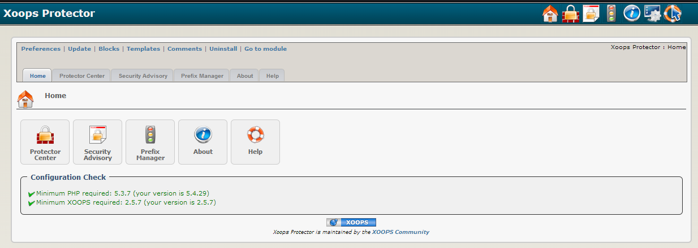

### _XOOPS Documentation Series_

# Module Protector
#### for XOOPS 2.5.7
  

## User Manual
 
© 2014 The XOOPS Project (www.xoops.org)    
  

## Module Purpose 

 
Protector is a very useful module that can help improve the security of your XOOPS site, and is widely regarded as a ‘must have’ module for all XOOPS websites. Protector is capable of defending against:
-	Some kinds of denial of service (DOS) attacks, bandwidth-hungry crawlers and spambots.
-	SQL injection, variable contamination, null bytes, session hijacking, and some kinds of cross-site scripting.
-	Brute force attacks and directory traversals.
-	Uploading of camouflaged image files and executables.
-	Link and comment spammers.

Protector logs the attacking IPs and offers a range of countermeasures including IP bans, blank screens and automatic sanitisation of attempted injections etc. Protector also evaluates your site for certain vulnerabilities and providing warnings about them through a ‘security advisory’ page, and provides instructions on how to fix them.

 
  
*Figure 1: Main view of the Protector Module (Admin side)*

# Table of Content

* [Install/Uninstall](book/1install.md)
* [Administration Menu](book/2administration.md)
* [Preferences](book/3preferences.md)
* [Operating Instructions](book/4operations.md)
* [The User Side](book/5userside.md)
* [Blocks](book/6blocks.md)
* [Templates](book/7templates.md)
* [Filter Plugins](book/8other.md) 
* [Module Credits, License](book/9credits.md)
