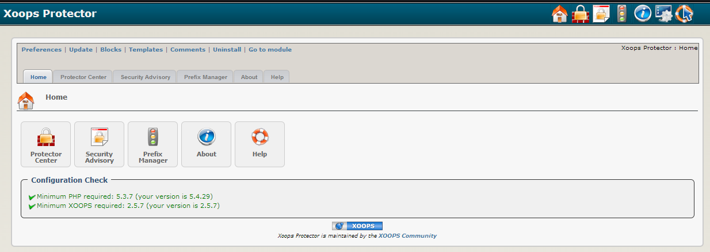

# Introduction

## Module Protector
  
#### for XOOPS 2.5.7

 
© 2016 XOOPS Project ([www.xoops.org](https://xoops.org))   
 
© 2016 XOOPS Project \([www.xoops.org](https://xoops.org)\)

### Module Purpose
 
Protector is a very useful module that can help improve the security of your [XOOPS](http://www.xoops.org)  site, and is widely regarded as a ‘must have’ module for all XOOPS websites. Protector is capable of defending against:
 
* Some kinds of denial of service \(DOS\) attacks, bandwidth-hungry crawlers and spambots.
* SQL injection, variable contamination, null bytes, session hijacking, and some kinds of cross-site scripting.
* Brute force attacks and directory traversals.
* Uploading of camouflaged image files and executables.
* Link and comment spammers.

Protector logs the attacking IPs and offers a range of countermeasures including IP bans, blank screens and automatic sanitisation of attempted injections etc. Protector also evaluates your site for certain vulnerabilities and providing warnings about them through a ‘security advisory’ page, and provides instructions on how to fix them.

 
_Figure 1: Main view of the Protector Module \(Admin side\)_

## Download/Fork the Module  

**You can fork the module --&gt;** [**here**](https://github.com/XoopsModules25x/protector)**\)**

### How to Contribute

[You can contribute on GitHub](https://github.com/XoopsDocs/protector-tutorial). Changes will be [pushed to Gitbook.io automatically](https://www.gitbook.com/book/xoops/protector-tutorial/activity) when the [main repository](https://github.com/XoopsDocs/protector-tutorial) changes.

Editing the book can be done either by updating the markdown files with a text editor, or opening the repository in [the Gitbook desktop app](https://github.com/GitbookIO/editor/blob/master/README.md). The desktop app will give you a live preview option.

## Table of Content

* [Install/Uninstall](install-uninstall.md)
* [Administration Menu](administration-menu.md)
* [Preferences](preferences.md)
* [Operating Instructions](operating-instructions.md)
* [The User Side](the-user-side.md)
* [Blocks](blocks.md)
* [Templates](templates.md)
* [Filter Plugins](filter-plugins.md) 
* [Module Credits, License](module-credits-license.md)
* [About XOOPS CMS](about-xoops-cms.md)

### License:

  
Unless specified, this content is licensed under a [Creative Commons Attribution-NonCommercial-ShareAlike 4.0 International License](http://creativecommons.org/licenses/by-nc-sa/4.0/).

All derivative works are to be attributed to XOOPS Project \([www.xoops.org](https://xoops.org)\)

All derivative works are to be attributed to XOOPS Project ([www.xoops.org](https://xoops.org))
