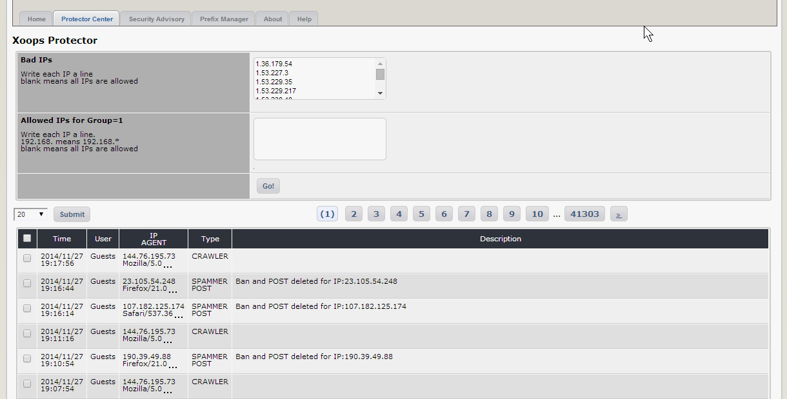
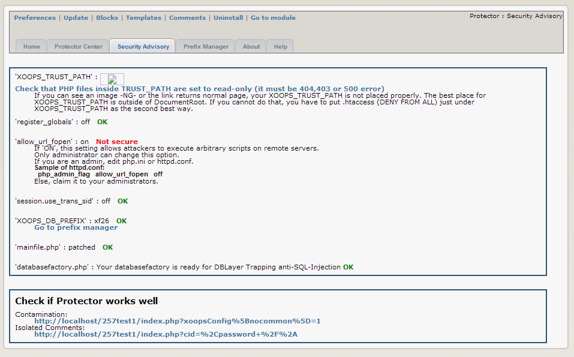
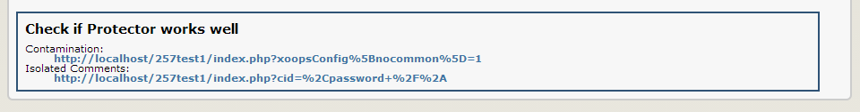
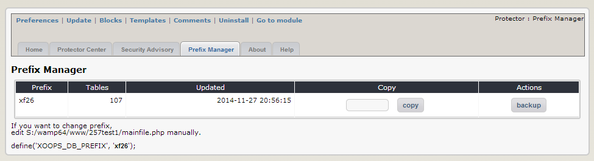

# Administration Menu

There are three major areas in Protector:

## **Protector Center**

The Protect Center \(below\) provides a convenient tool to ban the IP numbers of computers \(or people!\) that are causing you problems. It also provides a list of all IPs that have been banned to date, including those banned \(or at least, reacted to\) by the Protector module itself in response to incidents.

  
_Figure 2 The Protector Center_

Things that you can do here are:

| Option | Function |
| --- | --- |
| Bad IPs | You can ban the IPs of troublemakers by entering them in the box, each on a separate line. If you leave this line blank, that means all IPs are allowed. |
| Allowed IPs for Group=1 | Enter allowed IPs for group 1 \(webmasters\) in this box, each on a separate line. You can allow ranges of IPs, for example entering 192.168. will allow 192.168.\* |
| Log records | Protector keeps a log of IPs that have exceeded the limits of its security policies and triggered a response, as defined in the preferences section. Here you can see the offending IPs, and why they were listed. You can remove records by selecting the checkboxes and clicking the 'remove' button. |

## **Security Advisory**

The Security Advisory page evaluates the vulnerability of your site against several potential security risks and offers advice on how to fix them. In the screenshot below you can see that this site has one issue that should be fixed:

  
_Figure 3 The Security Advisory_

### **Fixing the security risks**

Follow the instructions below to implement security improvements recommended by Protector. Reload the Protect Center page to check your progress as you go - the red warnings should turn into a soothing green.

 **‘register\_globals’: on**

Fixing this issue is very easy. Create a text file called .htaccess. Place it in the root directory of your site. The file only needs to contain one line, as follows:

_php\_flag register\_globals off_

 **‘allow\_url\_fopen’: on**

This setting allows attackers to execute arbitrary scripts on remote servers. Unfortunately it may be difficult for you to fix because only an administrator can change this option. If you are renting disk space from a commercial host you need to ask them to make this change for you \(and frankly many hosts will refuse to modify a shared system for your convenience\). If you are lucky enough to have access, edit php.ini or httpd.conf and add \(or amend\) the following line to be:

_php\_admin\_flag allow\_url\_fopen off_

**‘session.use\_trans\_sid”: on**

Add another line to the .htaccess file in your website root directory, as follows:

_php\_flag session.use\_trans\_sid off_

**‘XOOPS\_DB\_PREFIX’ xoops**

This is covered in the section ‘Prefix manager’, below.

**‘mainfile.php’: missing precheck**

Edit your mainfile.php according to the steps described in the installation procedure \(step 8\). You shouldn't be seeing this warning if you followed it properly!

**Check if Protector works well**

Click on a link to test the module – you should get booted back out to the home page, depending on how you set up your preferences. You should also see entries added to the log in the Protect Centre.

  
_Figure 4 Check if Protector works well_

## **Prefix Manager**

The prefix manager lets you i\) change the prefix of your database tables by creating copies with a new prefix of your choice and ii\) backup your database. Why would you want to change the prefix? Well, by default the XOOPS installation script sets the prefix as ‘xoops’. The problem with this is that it is predictable, facilitating SQL injection attacks - if an attacker finds a hole in your site it will be easier for them to interfere with your database because they will be able to guess the full table names. Changing the prefix to something other than the default makes things a bit more difficult for them.

**Changing the database table prefix**

  
_Figure 5 Prefix Manager Tab_

Simply type the new prefix you would like to use in the blank box \(don’t use anything obvious, the whole idea of this is to be obscure\) and press the ‘copy’ button. A duplicate set of tables will be made with the new prefix.

**Note:** _**that this will double the size of your database.**_

However, to actually use the new set of tables you need to edit the file mainfile.php in your root directory, as per the footnote in the image above. Look for the following lines:

_// Table Prefix_  
 _define\('XOOPS\_DB\_PREFIX', 'xoops'\);_

Change ‘xoops’ to whatever your new prefix is and upload your modified mainfile.php. Don’t forget to CHMOD the file permissions to 444 \(read only in Windows\)! Once you have done that, your database will be running on the duplicate tables. Please note that any further changes in your database will not be reflected in the old tables.

**Backing up your database**

Just press the ‘backup’ button and you will be prompted to download an SQL file of your database.

**Deleting duplicate tables**

Since having duplicate sets of tables increases the size of your database so you might like to get rid of excess copies once you are sure the new set is working well. You can delete the old copies by pressing the ‘delete’ button \(good idea to back them up locally first in case you later discover you need them\). Note that you cannot delete the prefix/tables that are currently in use.

